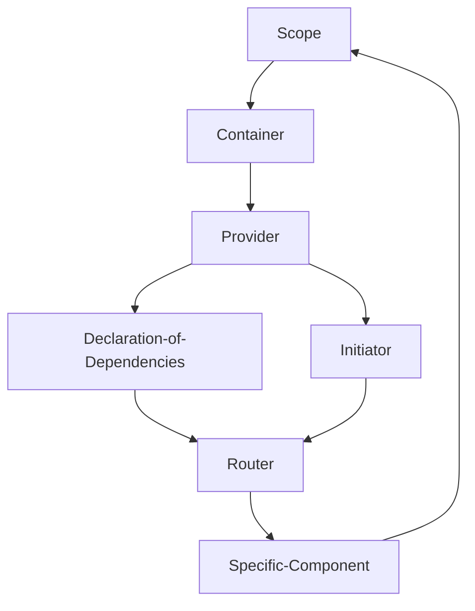

# React Guideline

## My vision have differences in the default stack react & redux.

### I like use "DI" pattern, I see more perspective on use this tool to build a app:
- this easy way to split logic and reuse code in other class (services). 
- if use rxjs library with "DI" we can do target render of component, if we subscribe in component on change data we can re-render component only if have changes or when we want do it. 
- I think we should split data and view state
- I mean data is data from server
- view state has responsibility just for how look view

### Naming convention
- {name}.scope.ts - it's file view create new DI container
- {name}.provider.ts - it's file with provide implementation {service, mapper, resource, etc...}
- {name}.router.ts - it's file with configuration of app routing
- {name}.service.ts - it's file with logic
- {name}.manager.ts - it's file with aggregation logic {services}
- {name}.resource.ts - it's file with request to data from 3rd party or api
- {name}.mapper.ts - it's file with implementation of transform data to another structure

### Diagram

