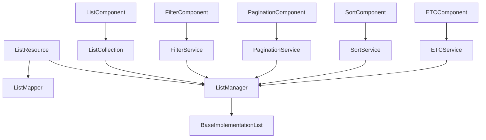

# Diagram

```mermaid
graph TD;
    ListResource-->ListMapper;
    ListResource-->ListManager;
    ListManager-->BaseImplementationList;
    ListCollection-->ListManager;
    FilterService-->ListManager;
    PaginationService-->ListManager;
    SortService-->ListManager;
    ETCService-->ListManager;
    ListComponent-->ListCollection;
    FilterComponent-->FilterService;
    PaginationComponent-->PaginationService;
    SortComponent-->SortService;
    ETCComponent-->ETCService;
```

## Goal

provide just resource and mapper for use base solution for specific case e.g: Mail, Feature